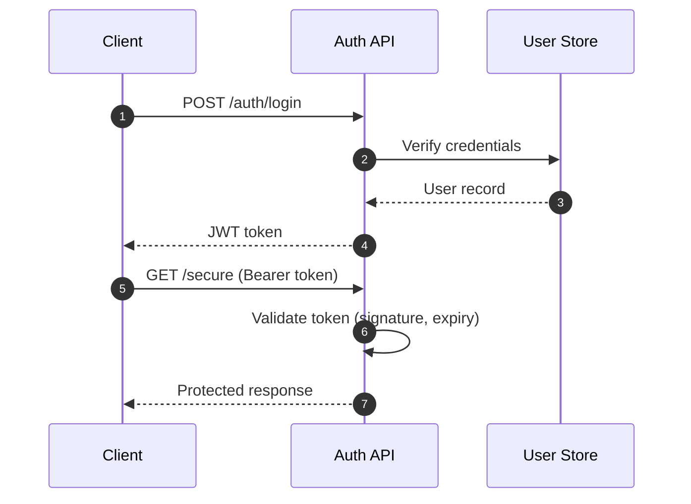
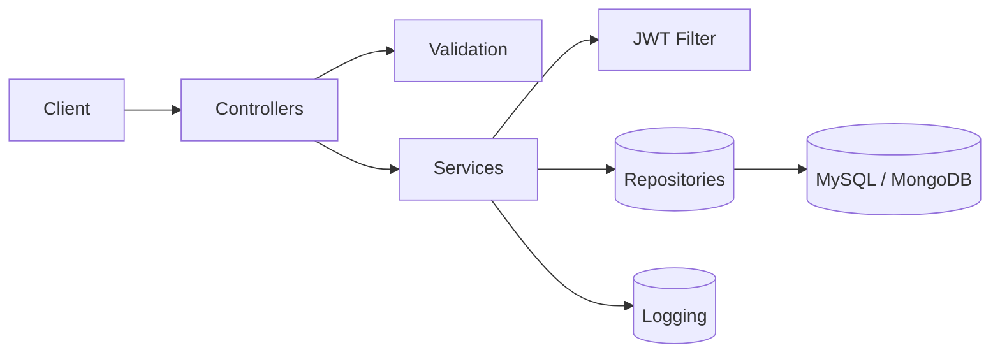
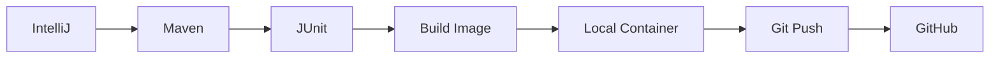
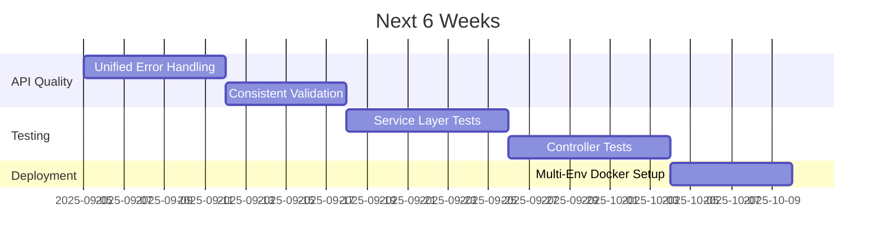

<!-- HEADER SECTION -->
<p align="center">
  
</p>

<h1 align="center">👨‍💻 Java Backend Developer</h1>

<p align="center">
  
  
  
  
</p>

<p align="center">
  
</p>

<p align="center">
  I build clean, testable, containerized backend services with Spring Boot, secure APIs with JWT, and work with both SQL & NoSQL storage.
</p>

---

### 🔧 Core Tech (Practical Focus)

<p align="center">
  
</p>

<p align="center">
  
  
</p>

---

### 🧩 What I Build (Abstracted Modules)

| Module | Purpose | Stack | Notes |
|--------|---------|-------|-------|
| Auth & Users | Register/Login + Roles | Spring Boot, JWT | Stateless endpoints |
| Quiz / Assessment | Attempt tracking + scoring | REST + MongoDB | Basic concurrency |
| Inventory CRUD APIs | Stock adjustments | Spring Data JPA + MySQL | Indexed queries |
| Core Data Layer | Repositories + DTO mapping | JPA / MongoTemplate | Separation of concerns |
| Deployable Service | Portable backend | Docker + EC2 | External config |
| Testing Basics | Service + Controller | JUnit | Expanding coverage |

---

### 🧠 Strength Areas
- REST API structure (CRUD, pagination, validation, DTO separation)
- Basic JWT authentication (access token, protected routes)
- Relational modeling + indexing (MySQL)
- Document modeling (MongoDB)
- Containerization (Docker)
- Layered architecture (Controller → Service → Repository)
- Structured error & logging patterns
- Consistent problem-solving (LeetCode & GFG)

---

### 🔐 Simple Auth Flow



---

### 🗂 Folder Pattern

```text
src/
 ├─ controller/    # REST endpoints
 ├─ service/       # Business logic
 ├─ repository/    # Data access
 ├─ dto/           # Request/Response models
 ├─ model/         # Entities/Documents
 ├─ config/        # Basic security & settings
 └─ exception/     # Global handlers
```

---

### 🧩 Component Overview



---

### ⚙️ Dev Flow



---

### 📊 Visual Stats

<p align="center">
  <!-- If this fails to load, open directly in browser -->
  
  
</p>

<p align="center">
  
</p>

<p align="center">
  <!-- Activity graph (may fail sometimes). Fallback: comment out if blank -->
  
</p>

<!-- Snake graphic will only show after workflow below is added -->
<p align="center">
  
</p>

---

### 📊 Skill Progress (Illustrative)

| Skill | Progress |
|-------|----------|
| Java Core/OOP | ████████████▓▒░ |
| Spring Boot | ███████████▓▒░░ |
| REST API Design | ██████████▓▒░░ |
| MySQL | █████████▓▒░░░ |
| MongoDB | ████████▓▒░░░ |
| Docker | ████████▓▒░░░ |
| Testing (JUnit) | ███████▓▒░░░░ |

---

### 🎯 Current Goals
- Better test coverage (service + controller)
- Cleaner DTO mapping conventions
- Consistent exception + validation responses
- Better schema planning before coding

<details>
<summary><b>Example Error Response Pattern</b></summary>

```json
{
  "timestamp": "2025-09-09T10:12:45Z",
  "path": "/api/products",
  "errors": [
    {"field": "name", "message": "must not be blank"},
    {"field": "price", "message": "must be greater than 0"}
  ]
}
```
</details>

<details>
<summary><b>JWT Filter Snippet</b></summary>

```java
String auth = request.getHeader("Authorization");
if (auth != null && auth.startsWith("Bearer ")) {
   String token = auth.substring(7);
   if (jwtService.valid(token)) {
      UsernamePasswordAuthenticationToken authObj =
          new UsernamePasswordAuthenticationToken(userDetails, null, userDetails.getAuthorities());
      SecurityContextHolder.getContext().setAuthentication(authObj);
   }
}
chain.doFilter(request, response);
```
</details>

---

### 🧭 Short-Term Learning Plan



---

### 🤝 Connect

<p align="center">
  <a href="https://www.linkedin.com/in/rashid-r-k-6b6aa5173/"></a>
  <a href="https://leetcode.com/u/RasidKhan123/"></a>
  <a href="mailto:khanrasidraja@gmail.com"></a>
  <a href="https://github.com/khanrasidraja"></a>
</p>

<p align="center">
  
</p>

<p align="center"><i>Focused on solid, practical backend fundamentals.</i></p>
